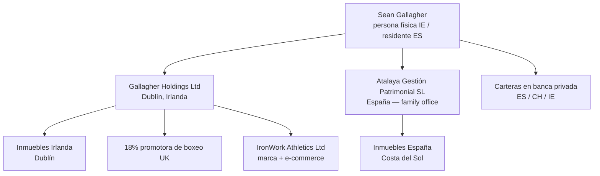

# Ficha de Escenario — Caso Convergente "Atalaya"

| Campo | Valor |
|---|---|
| Código | ESC-001 |
| Versión | 2.1 |
| Estado | Vigente |
| Clasificación | Pública — aprobada expresamente para difusión exterior por ser escenario ficticio |
| Propietario | Comité de Seguridad Convergente |
| Autor | Alejandro Tarquis Melgares |
| Fecha de emisión | 03/04/2026 |
| Fecha de aprobación | 24/07/2026 |
| Aprobado por | Comité de Seguridad Convergente |
| Registro de aprobación | Aprobación dentro de la ficción del caso; no se redacta ni publica acta |

**Historial de versiones**

| Versión | Fecha | Cambios |
|---|---|---|
| 0.1 | 03/04/2026 | Borrador inicial (principal estadounidense) |
| 0.2 | 07/04/2026 | Principal irlandés con pasado penal juvenil; hijo mayor influencer; estructura patrimonial Irlanda↔España |
| 0.3 | 09/04/2026 | Corrección de cronología familiar |
| 1.0 | 10/04/2026 | Cierre del escenario como base de la Fase 1 |
| 2.0 | 24/07/2026 | **Revisión de criterio de campo.** Salto de versión entera conforme a SGSI-DOC-002 §3: la reescritura del detonante y de la cadena de detección cambia el escenario sobre el que se construye todo el sistema, que es a esta ficha lo que el alcance es al SGSI. Es el único cambio de entero del ciclo, y por eso se declara.  Reescritura del detonante: el instigador pasa de figura del entorno de Dublín a antiguo promotor deportivo con discrepancia económica, y ejecuta a través de un intermediario local. Reescritura de la cadena de detección: por reconocimiento de un vehículo, no por análisis. Desidentificación reforzada. Alta de la sección 8 (los fallos de ejecución), aportación directa de campo que reorienta el catálogo de riesgos. Cierre de los puntos que la v1.0 dejaba abiertos a revisión |
| 2.1 | 24/07/2026 | Revisión de coherencia con el resto del corpus. Corrección de la ventana temporal de los títulos en §1, que §12 declaraba retirada y seguía presente. Precisión de la composición de la estructura de Atalaya (§4): nueve personas, de las cuales siete empleados y dos externos estables, que es lo que sostiene el resto del sistema. Atribución de la administración de la domótica al MSP (§5), coherente con los cinco documentos que se apoyan en ella. Fechado del cuasi-incidente (§7). Cierre en §10 de la identidad de la representante de la propiedad. Corrección de la referencia cruzada del registro de revisión. Cabecera de control documental alineada con SGSI-DOC-002 §2 y §3 |

> **Aviso:** Este escenario es íntegramente ficticio. Personas, sociedades, patrimonios y hechos son inventados y no guardan relación con ninguna persona u organización real. La verosimilitud procede de la experiencia profesional del autor en protección patrimonial, no de ningún caso concreto.

---

## 1. El principal

**Sean Gallagher**, 45 años, irlandés (Dublín, barrio obrero del norte de la ciudad). Exboxeador profesional, campeón mundial en su categoría. Carrera sólida pero no de primera fila mediática. Se retira a mediados de la década siguiente a la de su debut.

**Pasado oscuro (público y asumido):** a los 19 años, condena por lesiones graves tras una pelea a la salida de un pub en Dublín. Cumple 18 meses. El boxeo es su salida: la historia de redención es parte de su marca pública desde entonces y la ha contado él mismo en entrevistas. No hay más recorrido penal ni vínculos con crimen organizado. Consecuencia útil para el caso: Sean minimiza sistemáticamente los riesgos de su entorno ("yo vengo de la calle, sé cuidarme") y desprecia todo lo que suene a protocolo.

**Relación con la tecnología: nula.** No usa email. No tiene ordenador. Todo pasa por WhatsApp y por su asistente personal. Firma lo que le ponen delante. Su única presencia digital directa es un Instagram que gestiona una agencia.

**Origen del patrimonio:** bolsas de la carrera (~20M€ netos) como semilla; el grueso, construido después:

- Cartera inmobiliaria en Dublín (residencial en zonas revalorizadas) y Costa del Sol, iniciada en 2015.
- Participación minoritaria (18%) en una promotora de boxeo británica de segundo nivel.
- **IronWork Athletics**: marca propia de equipamiento de boxeo y fitness con e-commerce, fundada en 2016.
- Cartera financiera en banca privada.

**Patrimonio neto estimado: ~110 M€.**

**Traslado a España (2018):** casado con **Elena Vidal**, española, exdirectiva de marketing deportivo. En 2018 la pareja fija su residencia principal en la zona de Marbella, donde nace en 2020 el tercer hijo. Residencia fiscal española desde 2019, con patrimonio e intereses activos en Irlanda.

**Perfil público:** semi-retirado. Instagram verificado (~700K seguidores) gestionado por agencia. Comentarista ocasional en boxeo. Muy conocido en la numerosa comunidad irlandesa de la Costa del Sol, donde hace vida social sin ninguna medida de discreción.

## 2. La familia

| Miembro | Edad | Perfil de exposición |
|---|---|---|
| Sean Gallagher | 45 | Pública histórica. Analfabeto digital. Vida social abierta en la comunidad irlandesa local. |
| Elena Vidal | 43 | Perfil bajo deliberado. LinkedIn activo (patronato de una fundación). Sin Instagram público. Es quien de facto entiende y autoriza los asuntos del family office. **Su impulso protector nace del miedo, no de una valoración de riesgo** — un matiz con consecuencias de diseño (ver sección 9). |
| Cian G. | 17 | **Vector crítico.** El hijo mayor. Influencer en construcción: ~120K seguidores entre Instagram y TikTok, marca personal montada sobre ser "el hijo del campeón". Publica entrenamientos, coches, fiestas y ubicaciones casi en tiempo real. Conflictivo: expulsado de un colegio, entorno de amistades sin ningún filtro, relación tensa con la madre e idealización del pasado duro del padre. |
| Sofía G. | 14 | Instagram privado pero con ~900 "amigos" aceptados sin criterio. Colegio internacional identificable en fotos. |
| Liam G. | 6 | Sin RRSS propias. Aparece en publicaciones de terceros (cumpleaños, colegio). |

> **Convención de nomenclatura.** En los documentos del SGSI, Cian se designa siempre como **«el hijo mayor»** y nunca por su nombre: son documentos formales que circulan entre plantilla y terceros. Los nombres propios se usan únicamente en esta ficha y en el informe ejecutivo a la propiedad (SGSI-INF-001), que se dirige a sus padres y está escrito en lenguaje llano. «El hijo menor» designa a Liam y a nadie más.

## 3. Estructura patrimonial (simplificada)

- **Atalaya Gestión Patrimonial SL** es el family office: sociedad española que emplea al personal, gestiona los inmuebles en España y coordina a los asesores de ambos países.
- La estructura irlandesa la llevan asesores externos en Dublín. **Interfaz crítica:** flujo constante de información fiscal, societaria y patrimonial sensible entre España e Irlanda por canales no formalizados (email personal, adjuntos sin cifrar, WhatsApp).

## 4. El family office: personas

**Estructura de Atalaya GP SL — nueve personas: siete empleados y dos externos estables.**

| Rol | Perfil | Nota de riesgo |
|---|---|---|
| Directora general | Española, ex-banca privada, 5 años en el puesto | Acceso total a información patrimonial. Reporta de facto a Elena |
| Responsable financiero | Español, contable + reporting a asesores irlandeses | Maneja el flujo España↔Irlanda. Ejecuta las disposiciones en efectivo sin doble validación |
| Asistente personal del principal | Irlandesa, viaja con Sean | Acceso a agenda, viajes y dispositivos. Es el "interfaz digital" de Sean: su email, sus firmas, sus claves |
| Asistente administrativa | Española | Gestión documental en papel, sin criterios de clasificación ni inventario |
| Property manager | Español, gestiona inmuebles ES | Llaves, códigos, relación con contratas. Contrata obras sin preaviso ni acreditación. Titular de las cuentas de geolocalización de fabricante de los vehículos |
| Jefe de seguridad | Español, ex-FCS, 4 años en el puesto | Seguridad física; sin visibilidad de lo digital. **Conocimiento local del entorno que no está escrito en ningún sitio** |
| House manager | Filipina, 6 años con la familia | Coordina personal doméstico (4 personas vía agencia) |
| *Escolta/conductor ×2* | *Externos de empresa de seguridad, estables* | *Rotación baja pero contrato mercantil. Retrasos recurrentes en las recogidas* |

**Por qué la distinción importa.** Los dos escolta/conductor trabajan a diario dentro del perímetro y se cuentan en los nueve porque operativamente son parte de la casa, pero **no son empleados de Atalaya**: su vínculo es mercantil, a través de la empresa de seguridad física, que el SGSI clasifica como tercero de nivel T2 (SGSI-DOC-006 §2) y cuyo servicio operativo queda excluido del alcance (SGSI-DOC-001 §7.3). La cifra que sostiene los argumentos del sistema —segregación de funciones materialmente imposible, ausencia de independencia interna para auditar, catálogo de 25 escenarios sostenible— es la de **nueve personas en la estructura**, no la de nueve empleados. Los documentos del SGSI la usan en ese sentido.

**El círculo histórico (el problema):** dos personas del entorno de Dublín integradas de facto, fuera de toda estructura:

- **Paddy Doyle**, su entrenador de toda la vida, 69 años. Vive en una casa de invitados de la finca. Sin contrato, sin rol definido. Acceso físico total. Habla de la familia con su círculo de Dublín por WhatsApp.
- **Declan "Dec" Murphy**, amigo de infancia, 46 años. "Gestor" de IronWork Athletics y de los asuntos de Sean en Irlanda. Poderes notariales amplios otorgados en 2015 y nunca revisados. Usa cuentas de email personales para asuntos de las sociedades.

Ninguno aparece en un organigrama. Ambos tienen más acceso real que la mitad de la plantilla formal.

## 5. Proveedores y terceros con acceso

| Tercero | Servicio | Acceso |
|---|---|---|
| Despacho fiscal/legal en Dublín | Societario irlandés, fiscalidad IE | Información patrimonial completa |
| Despacho legal español | Societario, inmobiliario | Contratos, escrituras |
| Banca privada (3 entidades: ES, CH, IE) | Gestión de carteras | Posiciones, movimientos |
| MSP informático local | IT del family office y de las residencias | **Administrador de todo**: red, correo, NAS, CCTV y domótica. Sin contrato de confidencialidad específico ni acceso auditado. Criterio técnico desactualizado: desconoce lo que desconoce |
| Agencia de comunicación | Instagram de Sean, prensa | Acceso a la cuenta del principal y a material personal, a través de una persona designada de su equipo |
| Empresa de seguridad física | Escoltas, vigilancia residencia | Rutinas, agenda, planos |
| Agencia de personal doméstico | 4 empleados en residencia principal | Acceso físico diario |
| Contratas de mantenimiento (piscina, jardín, mantenimiento físico de la domótica) | Recurrentes | Acceso físico periódico, sin control de altas/bajas, sin planificación previa. El mantenimiento físico de la domótica es suyo; su administración lógica, del MSP |

## 6. Activos e infraestructura (semilla del inventario)

- Residencia principal: finca en la zona de Marbella. Domótica, CCTV IP, NAS doméstico (fotos familiares, documentos escaneados), red WiFi única compartida por familia, empleados e invitados.
- Segunda residencia: piso en Dublín (gestionado en remoto por Dec).
- Oficina del family office: local en Marbella. Servidor de ficheros, correo en Microsoft 365 (configuración por defecto del MSP).
- Dispositivos: sin inventario. Mezcla de personales y "de trabajo". Los adolescentes con acceso a la WiFi general.
- Vehículos: 6, dos blindados. Geolocalización del fabricante activa, cuentas gestionadas por el property manager.
- **Documentación en papel:** societaria, fiscal y patrimonial. Correcta y completa, pero repartida entre oficina y residencia, sin inventario ni custodia definida. Nadie puede saber si falta algo.

## 7. El detonante

**Cuándo.** La cadena arranca en diciembre de 2025 y se destapa a finales de febrero de 2026, unas diez semanas después. El SGSI se contrata en abril de 2026 y su diseño cierra el 24 de julio de 2026, que es la fecha de corte de toda la documentación del caso.

**Quién lo instiga.** Un antiguo promotor deportivo de la etapa de competición de Sean. Puso dinero en su carrera cuando nadie apostaba por él y quedó convencido de que la liquidación de la retirada no fue la pactada. La discrepancia nunca llegó a los tribunales y lleva años dormida. No es un delincuente: es un empresario con una cuenta que considera abierta y con recursos para presionar. Quiere sentar a Sean a negociar desde una posición de ventaja, y para eso necesita saber qué tiene, dónde lo tiene y qué le importa.

**No aparece nunca.** No viaja, no llama, no escribe. Encarga.

**Quién lo ejecuta.** Un individuo del entorno local de la Costa del Sol, con mala reputación conocida en la zona y una relación con el promotor que en ciertos círculos se da por sabida. Ese vínculo no está escrito en ninguna parte: vive en la cabeza de tres o cuatro personas que no hablan entre ellas.

**Cómo entra.** No trabaja al hijo mayor: se deja ver. Aparece en el gimnasio, en los sitios donde el chaval se mueve, con un coche llamativo y la actitud del hombre que ha vivido lo que Cian idealiza. Es **Cian quien busca el contacto**. A partir de ahí, en encuentros presenciales y por mensajería, va soltando —sin conciencia de estar filtrando nada— rutinas de la familia, fechas de viajes del padre, cómo funciona la seguridad de la finca, qué coches se usan y quién los lleva. Y se hace fotos con él.

**Cómo se destapa.** Un miembro del servicio de seguridad reconoce un vehículo estacionado en un punto y una hora que no cuadran, en el perímetro de la finca. No lo identifica por matrícula ni por análisis: lo reconoce porque sabe de quién es y sabe con quién anda ese hombre. Semanas después, en las fotografías que Cian publica, aparece el mismo coche.

**Por qué eso es el problema y no la solución.** La cadena se rompió por una capacidad individual: dependía de que esa persona concreta estuviera de servicio, se acordara del vehículo y atara los dos cabos. No hay proceso, no hay registro, no se puede repetir ni auditar. Si ese día libra, no se detecta nada. Y nadie puede reconstruir qué información salió ni desde cuándo, porque no existe nada que reconstruir: ni clasificación, ni normas de uso de redes, ni registro de visitas, ni forma de cruzar un indicio físico con uno digital.

**La reacción.** Elena fuerza la decisión desde el miedo, no desde el criterio: se contrata a un consultor externo especializado en seguridad convergente para implantar un SGSI en Atalaya GP SL. Sean lo acepta a regañadientes. El consultor no tiene nombre ni marca en el caso: es "el consultor".

**Por qué este detonante sostiene la tesis:** ingeniería social + amenaza interna involuntaria + OSINT + aproximación física real, en una sola cadena. Ningún control puramente digital ni puramente físico lo habría cortado por separado. Y la detección que funcionó fue, ella misma, convergente: observación física cruzada con rastro digital, hecha a mano y por azar dentro de la cabeza de un empleado. El SGSI existe para convertir ese azar en proceso.

**Cuasi-incidente, no incidente.** En todo el corpus se designa así: la cadena se interrumpió en el eslabón 5 y la acción final nunca llegó a producirse. Llamarlo «incidente» sería inflar lo ocurrido, y el caso no lo necesita.

## 8. Lo que pasa el resto de los días

El detonante es un ataque. La operativa diaria de esta casa no lo es, y ahí está la mayor parte de la exposición real. Esta sección recoge el criterio de campo que reorientó el catálogo de riesgos en la revisión de julio de 2026: **el agujero no lo abre un adversario sofisticado, lo abre un martes cualquiera.**

| Lo que ocurre | Por qué importa |
|---|---|
| La persona que limpia olvida conectar la alarma al cerrar y deja aberturas secundarias abiertas | El perímetro declarado no existe durante ventanas recurrentes y previsibles. El control está contratado, operativo y no se ejecuta |
| El vigilante se enrolla en conversaciones largas y descuida la ronda | Igual que arriba: existe el control, falta la ejecución, y no hay registro que lo delate |
| El conductor llega tarde y la familia espera en la calle veinte minutos | Punto fijo, previsible y sin cobertura. No hay actor hostil en el origen: hay un fallo de coordinación que construye la ventana |
| Las obras y reparaciones entran sin preaviso ni lista de personas | Desconocidos circulando por zonas sensibles. Un acompañamiento no puede organizarse para una visita que se desconoce |
| Los hijos meten visitas sin avisar | Es exactamente por donde entró el detonante |
| El dinero se mueve en efectivo, en mano, por el jefe o alguien de confianza | Una sola persona decide, ejecuta y custodia. El portador es la diana. Y no queda rastro reconstruible |
| Elena compra en webs de dudosa procedencia | Vector de compromiso doméstico sobre una persona con acceso total a la información familiar |
| El informático es bueno pero está desfasado | No es negligencia ni deslealtad: no sabe lo que no sabe. Decisiones por defecto que nadie cuestiona |
| Sean no entiende de tecnología y no se entera de nada | El firmante de las órdenes no puede valorar lo que firma |
| Los papeles están en regla pero por todos lados | Correctos, completos y visibles para cualquiera que entre. Y no se puede saber qué falta |
| Los viajes se deciden y reservan sin evaluar el destino | La seguridad se improvisa en destino, con el itinerario ya difundido entre proveedores |

**Consecuencia de diseño.** Un catálogo de riesgos construido solo desde el adversario habría dado por buenos la alarma, el vigilante y el conductor, porque están contratados. De aquí sale la definición de **cobertura efectiva** de la metodología: un control solo cuenta si está implantado *y* su ejecución deja evidencia registrada. Y de aquí salen los escenarios RSC-018 a RSC-025, dos de los cuales acaban empatando en el nivel máximo del registro con el propio cuasi-incidente fundacional (RSC-018 y RSC-021, Crítico 16).

## 9. La dinámica de poder (y por qué es un riesgo del sistema)

Quien empuja la contratación es Elena, y lo hace desde el susto. Quien tiene la autoridad es Sean, y desprecia el procedimiento. Esa combinación produce un patrocinio que **decae a medida que el suceso se aleja**.

Tratamiento en el diseño: la declaración de compromiso de una página la firma Sean y no Elena, para que el compromiso formal no dependa de quien lo impulsó por temor; los indicadores del ciclo miden ejecución sostenida y no implantación puntual; y el riesgo queda registrado como riesgo del propio SGSI, no como color del escenario (SGSI-DOC-001 §9).

## 10. La representante de la propiedad: un rol tomado de la realidad, no inventado

El caso incorpora la figura de una **representante de la propiedad** que hace de puente entre la familia y el sistema. En este escenario ese papel lo desempeña **Elena Vidal**, cónyuge del principal, y así lo formaliza SGSI-DOC-003 §6.1. No se presenta como buena práctica: se presenta como **lo que ya existe de facto en la mayoría de estas casas** — una persona de confianza con funciones delegadas y sin formación específica para ejercerlas.

El trabajo del SGSI no es inventar ese rol. Es coger al que ya está y darle competencias, límites y respaldo por escrito. Cuando la política lo describe como «rol creado ad hoc», se refiere a que **no tiene equivalente en la norma**, no a que el sistema lo haya inventado en esta casa: la figura preexistía, lo que se crea es su marco.

Esa figura es a la vez parte de la solución y un riesgo en sí misma, y el sistema lo dice. Es la misma persona de la sección 9: quien impulsa el sistema desde el miedo es también quien lo representa ante la familia, y esa concentración es precisamente lo que obliga a que el compromiso formal lo firme el principal y no ella.

## 11. Encaje de las tres patas del caso

- **ISO 27001 (Fase 1):** implantación del SGSI en Atalaya GP SL por el consultor externo. Alcance: el family office y sus interfaces con la familia, el círculo histórico, las residencias y los terceros.
- **Herramienta de IA (Fase 2, capstone):** el detonante la justifica sola — monitorización de huella digital y exposición OSINT de la familia con alerta temprana. Se define en su momento; el escenario ya le deja el hueco.
- **ISO 42001 (Fase 3):** gobernanza de esa herramienta: tratará datos de menores, geolocalización y perfiles de riesgo de personas. Caso de uso de alto riesgo servido.

## 12. Decisiones de desidentificación

La v2.0 refuerza este apartado. La versión anterior situaba al instigador como figura poderosa y conocida del entorno de Dublín con capacidad de encargar vigilancia en la Costa del Sol: una combinación demasiado próxima a casos mediáticos reales, con personas vivas detrás. El riesgo no era legal sino de lectura — cualquier lector del sector habría dejado de leer el criterio técnico para averiguar de quién se hablaba.

Correcciones aplicadas:

- **El instigador es un antiguo promotor deportivo**, arquetipo del género y por tanto no atribuible a nadie en concreto. Sin nombre, sin nacionalidad relevante, sin apariciones. La cuenta pendiente es económica y discutida, nunca un delito imputado.
- **Sin combates, categorías ni fechas exactas.** Se ha retirado la referencia al peso y a la ventana temporal de los títulos, que permitían contrastar contra palmarés reales. La v2.1 completa esta retirada: la v2.0 la declaraba y la sección 1 seguía fechando los títulos.
- **El intermediario local** no tiene ficha ni nombre: solo reputación y un vínculo conocido en la zona. Es la función lo que importa, no el personaje.
- La condena juvenil se mantiene: es en Irlanda, por lesiones en una pelea, arquetipo del boxeador redimido, sin lectura de crimen organizado.
- Patrimonio construido post-carrera (inmobiliario + marca), no con bolsas récord.

---

## Registro de la revisión de criterio (julio 2026)

La v1.0 cerraba con tres puntos abiertos a validación de campo. Quedan cerrados así:

1. **La cadena de detección** era de despacho: se resolvía cruzando merodeos con Instagram, algo que en la práctica nadie hace. Sustituida por reconocimiento de un vehículo apoyado en conocimiento local, con la consecuencia de diseño que se explica en la sección 7.
2. **El calibrado de Paddy y Dec** (sección 4, el círculo histórico) se mantiene, y se confirma que el desorden que describen es el estado normal y no una exageración narrativa.
3. **La dinámica del principal y su cónyuge** se corrige: no es que Elena fuerce la contratación, es que la empuja desde el miedo. Ese matiz genera un riesgo del propio sistema (sección 9).

Además, la revisión aportó la sección 8 completa, que reorienta el catálogo de riesgos hacia los fallos de ejecución. Los criterios de valoración de probabilidad de la metodología (SGSI-DOC-004 §4.2) proceden igualmente de esta revisión.
