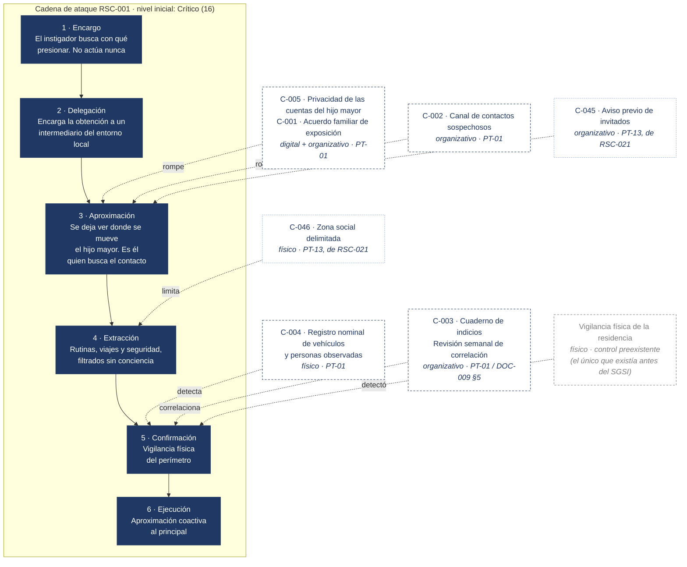

# RSC-001 — La cadena, eslabón a eslabón

El riesgo que originó el SGSI, dibujado como lo trata la metodología (SGSI-DOC-004): una cadena de seis eslabones que cruza los dominios digital, organizativo y físico, con cada control del plan de tratamiento situado sobre el eslabón que rompe.

La regla de convergencia exige, para un escenario Crítico, cobertura efectiva en los dominios físico y digital. El tratamiento diseñado sitúa controles en los eslabones 3, 4 y 5, y en ambos dominios. Que aún no alcance cobertura *efectiva* —ningún control está implantado a fecha de corte— es otra cosa, y se lee en la hoja «Controles» del registro.

**Nota sobre los controles prestados.** C-045 y C-046 pertenecen a RSC-021 y al plan PT-13, no a PT-01, que son C-001 a C-005. Aparecen aquí porque actúan también sobre esta cadena —el aviso previo de invitados y la zona social interrumpen la aproximación y limitan lo que se puede observar dentro— y porque RSC-021 es, literalmente, la vía por la que entró este escenario. Se dibujan con trazo distinto para que no se cuenten dos veces: la cobertura de RSC-001 a efectos de la regla de convergencia la dan C-004 (físico) y C-005 (digital).

## Lo que el diagrama cuenta

**Los dos primeros eslabones son inalcanzables, y eso es una conclusión, no una carencia.** El instigador no aparece nunca: no viaja, no llama, no escribe. Ningún control de Atalaya puede tocar el encargo ni la delegación. Un análisis honesto lo dice en vez de inventarse un control que "mitiga la motivación del actor". La cadena se ataca desde el eslabón 3.

**Antes del SGSI solo existía el control del eslabón 5.** La vigilancia física detectó, sí — pero detectar en el eslabón 5 significa detectar cuando el adversario ya tiene la información y está confirmándola sobre el terreno. Tarde y caro.

**Y detectó por azar.** Un miembro del servicio de seguridad reconoció un vehículo porque sabía de quién era y con quién andaba — no por la matrícula ni por ningún análisis. Esa capacidad no era repetible ni auditable: dependía de que esa persona estuviera de servicio, se acordara y atara los cabos. Si libra ese día, no se detecta nada. **El control funcionó una vez, y no por diseño.** Esa frase es el argumento fundacional de todo el sistema.

**El tratamiento empuja la detección hacia la izquierda.** La privacidad de las cuentas y el acuerdo de exposición encarecen la aproximación; el canal sin reproche y el aviso previo de invitados la interrumpen; la zona social limita lo que se puede observar dentro; y el cuaderno de indicios garantiza que, si todo lo anterior falla, los indicios de ambos dominios se cruzan **en la semana 4 y no en la 10** (reconstrucción documentada en SGSI-REG-004, hoja «Reconstrucción 2026»).

Esas seis semanas de diferencia son el intervalo durante el cual el intermediario mantuvo contacto directo con un menor. Ese intervalo, y no el resultado final, es lo que el sistema reduce.

**Riesgo residual: Alto (8), aceptado por el jefe de seguridad como propietario del riesgo y ratificado por el Comité.** La cadena no se puede eliminar —la exposición pública del hijo es parte de su vida y de su trabajo— pero sí encarecer cada eslabón y acortar el tiempo de detección. Esa es la diferencia entre gestionar un riesgo y fingir que desaparece.

---

## El escenario que este diagrama no dibuja

RSC-001 es el riesgo estrella del caso, pero ya no está solo en lo más alto del registro. Tras la revisión de julio de 2026 empatan con él en el nivel máximo del registro, Crítico (16), otros dos escenarios: **RSC-018**, la inejecución sistemática de los controles físicos que ya existen, y **RSC-021**, la introducción de terceros no verificados en la residencia por los hijos.

Ninguno de los dos tiene un adversario en el origen. Y el segundo es, literalmente, la vía por la que entró este.
