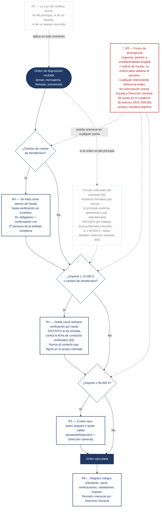

# Flujo de verificación de una orden financiera (SGSI-DOC-007)

Las seis reglas de verificación (§2) aplicadas en secuencia a una orden de disposición, con el freno de emergencia (R5) como vía transversal que cualquiera puede activar en cualquier punto. Trata RSC-006 (suplantación de asesor/proveedor), RSC-010 (suplantación del principal ante la banca, incluida voz sintética) y RSC-014 (abuso de la identidad digital delegada).

## Lo que el flujo no deja pasar

**El freno de emergencia no es el último paso: es transversal.** R5 no espera a que la orden falle una regla — cualquier interviniente puede pararla en cualquier punto de la secuencia, sin autorización previa y sin consecuencias para quien la para. El coste de una falsa alarma es una reunión; el de no pararla, ya se conoce por el cuasi-incidente fundacional. Y se anota en el cuaderno de indicios con independencia de que la orden resultara legítima: el patrón de intentos importa aunque cada intento individual se explique.

**La voz nunca es un canal de verificación**, ni siquiera cuando quien llama es reconocible. Con cientos de horas de voz pública del principal, la suplantación por voz sintética (RSC-010) es hoy trivial — y por eso R2 no admite excepción por confianza o urgencia.

**El circuito del principal no es un atajo: es un circuito distinto y más estricto**, diseñado porque el principal no opera medios digitales propios y delega su identidad en su asistente personal. La videollamada la inicia siempre Atalaya hacia el dispositivo registrado — nunca se acepta una llamada entrante como confirmación —, lo que protege a la vez al patrimonio y a la asistente: ningún acto suyo en nombre del principal queda sin confirmar ni sin registrar.

**Lo que este diagrama no cubre: el efectivo.** Las disposiciones en efectivo y el movimiento físico de valores (RSC-019) no viajan por ningún canal verificable, así que R1-R6 no les aplican — DOC-007 §6 las trata con un juego de reglas propio (E1-E5), que es harina de otro diagrama.

**Aplicación de la regla de convergencia (DOC-004 §6).** E1/E2 (§6) son organizativos, E4 aporta la cobertura física y E3 la digital — la nota de trazabilidad ya está en el propio DOC-007, no se repite aquí.
