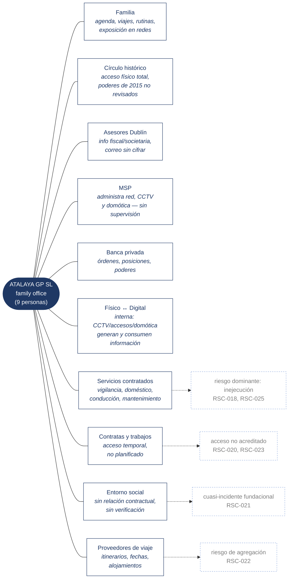

# Mapa de interfaces — dónde Atalaya se juega la eficacia

Las diez interfaces declaradas en SGSI-DOC-001 §7.4, con vocabulario cerrado, y el riesgo de borde que cada una describe literalmente en ese documento. La regla de completitud (SGSI-DOC-004 §5.1) exige que toda interfaz tenga al menos un escenario que la ponga a prueba, y que todo escenario cite una de estas diez — ninguna más.

## Lo que el mapa enseña

**Seis interfaces son originales; cuatro se añadieron en revisión.** Familia, Círculo histórico, Asesores Dublín, MSP, Banca privada y Físico↔Digital describían por dónde circula la *información*. Cinco escenarios del registro —RSC-018, RSC-020, RSC-021, RSC-022 y RSC-025— no encontraban dónde situarse porque el alcance original no recogía por dónde circulan *personas*. Servicios contratados, Contratas y trabajos, Entorno social y Proveedores de viaje cubren esa laguna (hallazgo HD-03, SGSI-DOC-010 §4.1).

**La interfaz que no admite contrato es la que produjo el cuasi-incidente.** Entorno social no se gestiona con cláusulas ni acuerdos formales — se gestiona por acuerdo con la familia y por diseño del espacio (SGSI-DOC-006 §8). Es la única interfaz de las diez cuyo control depende enteramente del cumplimiento voluntario, y es, literalmente, por donde entró RSC-001.

**MSP es el nodo de mayor concentración de poder.** Un solo tercero administra la infraestructura física y la lógica —CCTV, domótica, red, correo— sin supervisión interna cualificada. Es la interfaz que más deuda documental arrastra en la SoA (5.6, 8.7, 8.12, 8.19, 8.23 no tienen soporte documental propio en el anexo del MSP).

**Físico↔Digital es interna, no con un tercero — y es la que da nombre al caso.** No cruza el límite de la organización: cruza el límite entre dos dominios que, en esta estructura, nunca se habían mirado (DOC-001 §5: "quien protege la finca no tiene visibilidad sobre quién administra sus cámaras"). La convergencia no es una interfaz más entre diez; es la premisa que hace del resto del mapa un solo sistema en lugar de dos.
