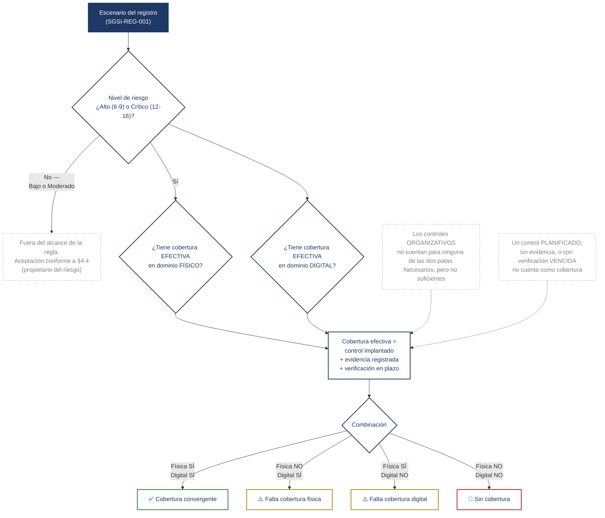

# La regla de convergencia, dibujada

Lo que exige SGSI-DOC-004 §6, y lo que ejecuta literalmente `convergence-check` (capa 2) sobre el registro. No es un párrafo de metodología: es una función. Este diagrama es esa función dibujada.

## Lo que la regla dice y lo que la regla calla

**La regla se aplica al escenario, no al control.** Un escenario puede tener cuatro controles físicos y uno digital y cumplir; la confusión contraria —"cada control necesita su gemelo"— produce relleno. Lo único que un control debe declarar es qué eslabón de la cadena rompe.

**"Sin cobertura" no significa una sola cosa.** El registro real (24/07/2026) tiene dos escenarios en ese estado por motivos opuestos: RSC-016 no tiene ningún control diseñado en ninguno de los dos dominios — es un fallo de diseño, deuda de HD-02. RSC-018 tiene sus cuatro controles implantados y con evidencia, pero la verificación de los controles físico y digital ha vencido; el único que sigue en plazo es organizativo, que no cuenta. Es un fallo de verificación, no de operación, y el diagrama de decisión no lo distingue — hay que ir al registro a mirarlo. Es la limitación que el propio `README.md` del validador señala como lo primero que cambiaría.

**A fecha de corte (24/07/2026), la rama "Cobertura convergente" está vacía.** Ningún control del registro ha alcanzado el estado IMPLEMENTADO; por tanto ningún escenario Alto o Crítico pasa hoy por la casilla ✅. Declararlo es parte de la propia regla (DOC-004 §6): un sistema que se apoya en un requisito verificable tiene que decir cuándo aún no lo cumple, no maquillarlo.

**La regla no se comprueba a mano.** Con 25 escenarios y 64 controles, cruzarlo a ojo se hace una vez y a los seis meses ya no vale. Por eso el diagrama de arriba no es una aspiración: es el código de `project.py` (funciones `clasificacion`, `es_grave`, `esta_cubierto`, `tiene_convergencia`, `diagnostico`) ejecutado sobre `riesgos.csv` y `controles.csv`.
